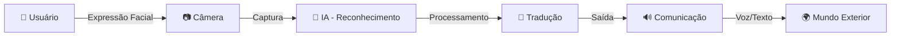

  

<h1 align="center">✨ Seja bem-vindo(a) ao Sinout ✨</h1>

<i>"Do rosto à fala, esse é o nosso dilema, porque quando o rosto fala o mundo entende!"</i>

  
  
  

---

## 🧠 O Significado de Sinout

O nome **Sinout** carrega em si a essência do nosso propósito:

### 🔮 **S** - Sinapse
A sinapse é a conexão entre neurônios, representando a comunicação cerebral. É o ponto de partida da nossa tecnologia: capturar o que nasce no cérebro.

### 🔄 **inout** - De Dentro para Fora
- **in** (dentro) - Os pensamentos, emoções e intenções que residem dentro de cada pessoa
- **out** (fora) - A expressão dessas intenções para o mundo exterior

### 🎨 A Identidade Visual

<table align="center">
  <tr>
    <td align="center" width="50%">
       
      <b>O Lado Humano</b> 
      Representa empatia, dignidade e a essência humana
    </td>
    <td align="center" width="50%">
       
      <b>O Lado Tecnológico</b> 
      Representa inovação, energia e transformação digital
    </td>
  </tr>
</table>

  <b>Juntos, roxo e laranja se encontram no cérebro:</b> 
  A tecnologia a serviço da humanidade. A inovação impulsionando a inclusão. 
  <i>Assim nasce o Sinout.</i>

---

## 📖 Sobre Nós

Nascidos de uma causa nobre, lutamos por aqueles que não conseguem se comunicar. Utilizamos **inteligência artificial** e **reconhecimento de expressões faciais** para dar voz a quem mais precisa.

Nossa solução traduz movimentos faciais em palavras, frases e comandos, permitindo que pessoas com limitações motoras e/ou de fala possam se expressar com dignidade.

---

## 🎯 Missão

Desenvolver e oferecer uma **tecnologia assistiva inovadora**, baseada no reconhecimento de microexpressões faciais, que permita a pessoas com limitações motoras e/ou de fala se comunicarem de forma **clara, rápida e personalizada**. 

Nosso compromisso é preservar a **dignidade** e a **qualidade de vida** dos usuários, garantindo que a solução seja:
- ✅ Acessível e intuitiva
- ✅ Inclusiva e livre de vieses
- ✅ Igualitária para todas as etnias, origens e condições socioeconômicas

---

## 👀 Visão

Ser reconhecido em todo o Brasil como **referência em tecnologia assistiva** baseada em expressões faciais, transformando a comunicação de pessoas com limitações motoras e/ou de fala.

Garantir que cada indivíduo, independentemente de sua condição física, origem ou contexto social, tenha acesso a uma **comunicação plena, inclusiva e humanizada**.

---

## 💜 Valores

### 🤝 Empatia
Nosso projeto nasce do desejo genuíno de melhorar a vida de pessoas que convivem com diferentes doenças e limitações motoras e/ou de fala, reconhecendo que todas merecem ser ouvidas, respeitadas e valorizadas. Colocamos-nos no lugar do outro para desenvolver soluções que realmente fazem a diferença.

### ⚖️ Ética
Conduzimos o projeto com profissionalismo, integridade e transparência. Reconhecemos que nossas ações impactam vidas e, por isso, mantemos o mais alto padrão ético em todas as decisões, garantindo privacidade, segurança e respeito profundo aos nossos usuários.

### 💡 Inovação
Utilizamos inteligência artificial e visão computacional de forma criativa e disruptiva para resolver problemas reais. Buscamos constantemente novas tecnologias e abordagens que possam ampliar o impacto positivo da nossa solução na vida das pessoas.

### 🌍 Compromisso Social
Trabalhamos incansavelmente para construir um mundo mais inclusivo e acessível. Nosso compromisso vai além da tecnologia: atuamos em parceria com famílias, profissionais de saúde, instituições e comunidades para garantir que ninguém fique para trás, promovendo dignidade, autonomia e igualdade de oportunidades para todos.

---

## 🛠️ Como Funciona

1. **Captura**: A câmera registra as microexpressões faciais do usuário
2. **Reconhecimento**: Nossa IA identifica padrões e movimentos
3. **Tradução**: O sistema converte expressões em comandos ou frases
4. **Comunicação**: A mensagem é transmitida via voz ou texto

---

## 👨‍💻 Equipe de Desenvolvimento

<table align="center">
  <tr>
    <td align="center">
      <a href="https://github.com/FabioRoberto-ppt">
        
         
        <b>Fabio Roberto</b>
      </a>
       
      Scrum Master & Dev Front-End
    </td>
    <td align="center">
      <a href="https://github.com/GuilhermefDomingues">
        
         
        <b>Guilherme França</b>
      </a>
       
      Dev Front-End & Marketing
    </td>
    <td align="center">
      <a href="https://github.com/Xcode-sketcher">
        
         
        <b>Eduardo Silva</b>
      </a>
       
      Dev Full Stack & DBA
    </td>
    <td align="center">
      <a href="https://github.com/IsaacZ33">
        
         
        <b>Erick Isaac</b>
      </a>
       
      Dev Full Stack & Financeiro
    </td>
    <td align="center">
      <a href="https://github.com/Felipe-Koshimizu">
        
         
        <b>Felipe Koshimizu</b>
      </a>
       
      Dev Front-End & UI/UX
    </td>
    <td align="center">
      <a href="https://github.com/luanarochamiron">
        
         
        <b>Luana Miron</b>
      </a>
       
      Product Owner
    </td>
  </tr>
</table>

---

## 🚀 Tecnologias

  

---

## 🌟 Funcionalidades

- 🎭 **Reconhecimento de expressões**: Detecção de movimentos faciais
- ⚙️ **Personalização**: Configurações adaptáveis a cada usuário
- 🖥️ **Plataforma Web**: Acesso via web por meio dee navegadores

---

## 🎬 Experimente a Plataforma

  
  
    
  
  

---

## 📞 Contato

Tem dúvidas ou sugestões? Entre em contato conosco!

  

---

  
<b>Feito com 💜 e 🧡 pela equipe Sinout</b>

  
<i>Transformando expressões em conexões, tecnologia em humanidade.</i>

  
   
  
  ⭐ Se este projeto te inspirou, deixe uma estrela!
  
    
  
  

